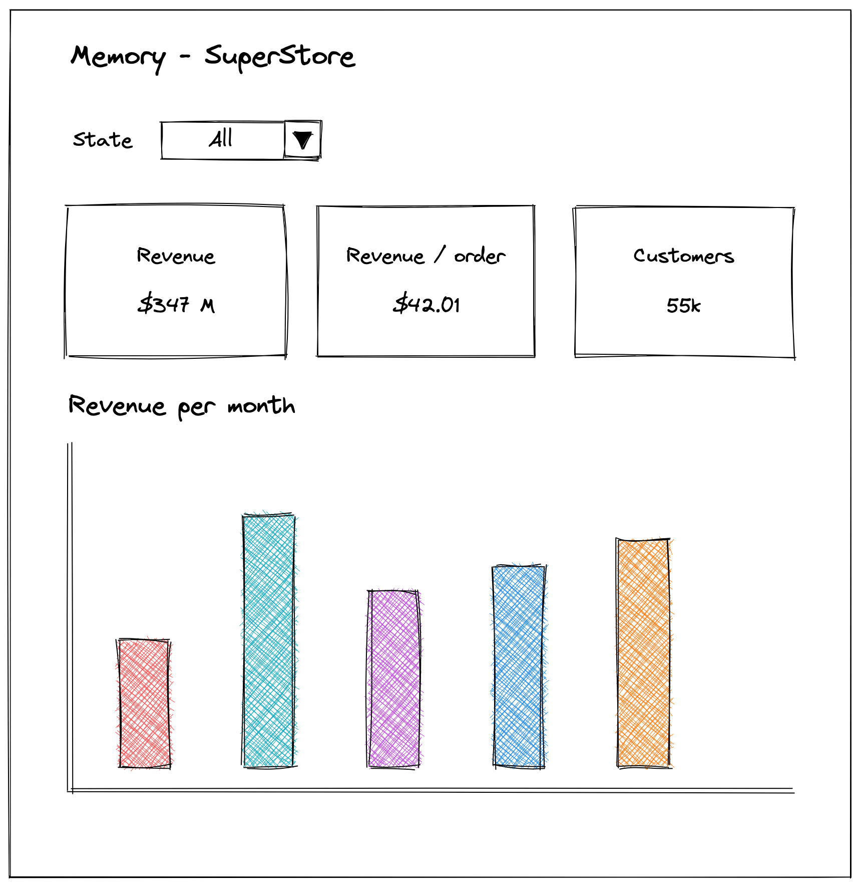
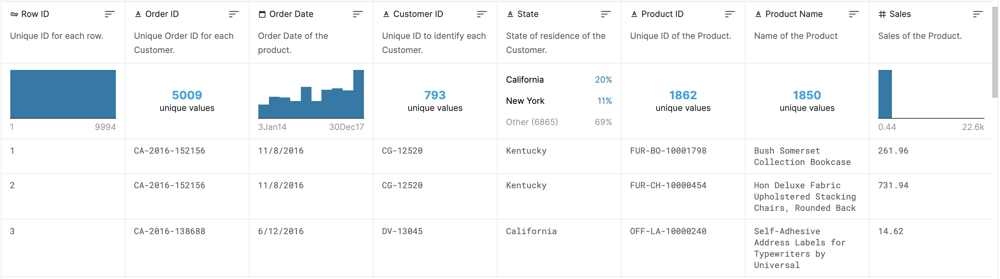

# 👩‍💻👨‍💻 Full-Stack Software Engineer Technical Test  

With growing demands and cut-throat competitions in the market, a Superstore Giant is seeking your knowledge in understanding what works best for them. They would like to understand their key indicators through a web dashboard to get started.

## 🎯 Your mission

* You've been provided a dataset containing Superstore past years transactions
* The client wants to work on three main metrics:
  * Total revenue (`revenue`)
  * Average revenue per order (`revenue_per_order`)
  * Number of unique customers (`customers_count`)
* The client wants to be able to check those metrics globally ("Total" filter) 
* The client wants to check the metrics broken down by State (`state`) and by month of order date (`order_date`)

Here is mockup of what it should look like:

### 💾 About the dataset

* The [sample dataset](dataset.csv) is provided in this repository
* There are some [metadata provided](metadata.md), describing the attributes

Here is a snippet of what the [dataset](dataset.csv) looks like

## 🧠 Guidelines 

**We expect your code to be:**

* **Maintainable**: simple, clean and easy to understand
* **Performant**: it must be production-ready. Pay attention to your SQL queries, consider the complexity of your algorithm

🎁 **Bonus points for:**

* Writing tests (well, we did say "production-ready")
* Applying OOP best practices
* Compute the evolution of each metric based on past year performance

## How to hand in the test

⚠️  **Please, DO NOT host your project on public repositories!** ⚠️ 

We ask you to package your repository as a Git bundle before sending it back to us. Here is how to do it.

1. `cd` into your code directory.
1. Run `git bundle create memory-test.bundle HEAD master` (use your branch name if it differs from `master`).
1. Finally, send us the `memory-test.bundle` file you just created at step 2.

---

Thanks for taking the time interviewing at Memory!

Good luck! 💪
